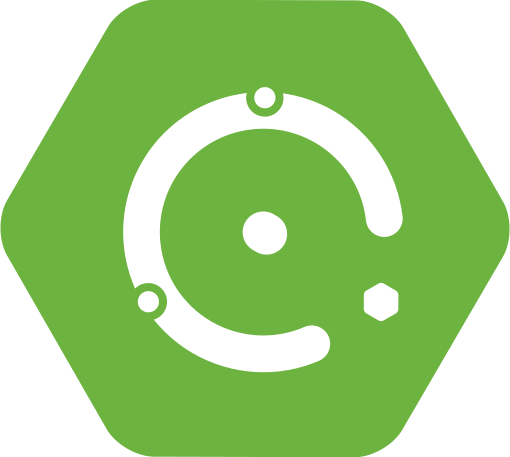

[![Contributors][contributors-shield]][contributors-url]
[![Forks][forks-shield]][forks-url]
[![Stargazers][stars-shield]][stars-url]
[![Issues][issues-shield]][issues-url]
[![Apache License][license-shield]][license-url]


# JoulesJS Starter


<!-- PROJECT LOGO -->
<br />
<p align="center">
  <a href="https://github.com/spring-projects/spring-boot">
    
  </a>
  <h3 align="center">JoulesJS Starter</h3>

  <p align="center">
    Starter for making hybrid desktop applications using Spring Boot ecosystem
    <br />
    <br />
    <a href="https://github.com/joulesjs/spring-petclinic">View Demo</a>
    ·
    <a href="https://github.com/joulesjs/spring-boot-starter-joulesjs/issues">Report Bug</a>
    ·
    <a href="https://github.com/joulesjs/spring-boot-starter-joulesjs/issues">Request Feature</a>
  </p>
</p>


<details open="open">
  <summary><h2 style="display: inline-block">Table of Contents</h2></summary>
  <ol>
    <li>
      <a href="#getting-started">Getting Started</a>
      <ul>
        <li><a href="#prerequisites">Prerequisites</a></li>
        <li><a href="#installation">Installation</a></li>
      </ul>
    </li>
    <li><a href="#adapt">Adapt</a></li>
    <li><a href="#roadmap">Roadmap</a></li>
    <li><a href="#contributing">Contributing</a></li>
    <li><a href="#license">License</a></li>
    <li><a href="#contact">Contact</a></li>
    <li><a href="#acknowledgements">Acknowledgements</a></li>
  </ol>
</details>


## Getting Started

By adding JoulesJS dependency to your Spring Boot project you automatically get:

- Automatic rejection of any request not originating from localhost
- See <a href="#adapt">Adapt</a> for other features and customisations
- See <a href="#roadmap">Roadmap</a> for upcoming features

### Prerequisites

JoulesJS requires Java 11+ to run.
### Installation

1. Add [Jitpack.io](https://jitpack.io/) repository:
```xml
	<repositories>
		<repository>
		    <id>jitpack.io</id>
		    <url>https://jitpack.io</url>
		</repository>
	</repositories>
```
2. Add dependency:
```xml
    <dependency>
        <groupId>io.github.joulesjs</groupId>
        <artifactId>spring-boot-starter-joulesjs</artifactId>
        <version>main-SNAPSHOT</version>
    </dependency>
```

## Adapt
Add the following to your **application.properties** if you want to

- Automatically open Google Chrome in App Mode when your application starts:
    > Windows
    ```properties
      joulesjs.command="C:/Program Files/Google/Chrome/Application/chrome.exe", "-app=%s"
    ```
    > Ubuntu
    ```properties
      joulesjs.command="google-chrome", "-app=%s"
    ```
    > macOS
    ```properties
      joulesjs.command="/Applications/Google\ Chrome.app/Contents/MacOS/Google\ Chrome", "-app=%s"
    ```

- Automatically close your Spring Boot application when you close Google Chrome:
    ```properties
      joulesjs.allowHeadless=false
    ```

- Allow connections originating from localhost and some other range of ips in your LAN:
    ```properties
      joulesjs.allowedIps=127.0.0.1, 0:0:0:0:0:0:0:1, 192.168.0.0/25
    ```

- Allow connections originating only from a specified set of ips. Localhost not included:
    ```properties
      joulesjs.allowedIps=172.28.160.1, 192.168.0.10, 192.168.0.33
    ```

## Roadmap

See the [open issues](https://github.com/joulesjs/spring-boot-starter-joulesjs/issues) for a list of proposed features (and known issues).


## Contributing

Contributions are what make the open source community such an amazing place to be learn, inspire, and create. Any contributions you make are **greatly appreciated**.

1. Fork the Project
2. Create your Feature Branch (`git checkout -b feature/AmazingFeature`)
3. Commit your Changes (`git commit -m 'Add some AmazingFeature'`)
4. Push to the Branch (`git push origin feature/AmazingFeature`)
5. Open a Pull Request


## License

Distributed under the Apache License. See `LICENSE` for more information.


<!-- MARKDOWN LINKS & IMAGES -->
<!-- https://www.markdownguide.org/basic-syntax/#reference-style-links -->
[contributors-shield]: https://img.shields.io/github/contributors/joulesjs/spring-boot-starter-joulesjs.svg?style=for-the-badge
[contributors-url]: https://github.com/joulesjs/spring-boot-starter-joulesjs/graphs/contributors
[forks-shield]: https://img.shields.io/github/forks/joulesjs/spring-boot-starter-joulesjs.svg?style=for-the-badge
[forks-url]: https://github.com/joulesjs/spring-boot-starter-joulesjs/network/members
[stars-shield]: https://img.shields.io/github/stars/joulesjs/spring-boot-starter-joulesjs.svg?style=for-the-badge
[stars-url]: https://github.com/joulesjs/spring-boot-starter-joulesjs/stargazers
[issues-shield]: https://img.shields.io/github/issues/joulesjs/spring-boot-starter-joulesjs.svg?style=for-the-badge
[issues-url]: https://github.com/joulesjs/spring-boot-starter-joulesjs/issues
[license-shield]: https://img.shields.io/github/license/joulesjs/spring-boot-starter-joulesjs.svg?style=for-the-badge
[license-url]: https://github.com/joulesjs/spring-boot-starter-joulesjs/blob/main/LICENSE.txt